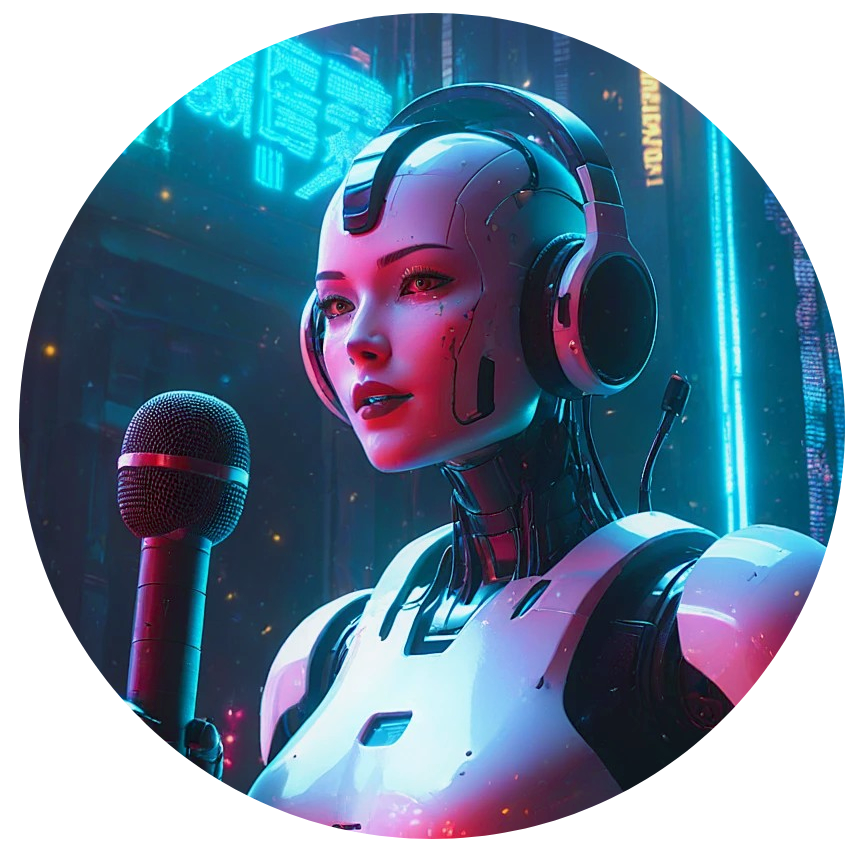

# Podcast gerado por I.A.s

 • [Demonstração](#demostração) • [Sobre](#sobre)• [Tecnologias Utilizadas](#tecnologias-utilizadas) • [Como foi feito](#como-foi-feito) • [Prompt usado para criação da imagem](#prompt-usado-para-criação-da-iamgem) • [Texto gerado pela IA](#texto-gerado-pela-ia) • [Personalização](#personalizacao) • [Estrutura de Pastas](#-estrutura-de-pastas) • [Licença](#licenca) • [Referências](#referências) • [Contato](#contato)

<p align="center">

</p>

<p align="center">
  <a href="https://on.soundcloud.com/viMJy2LGJLjfjdND9">CLIQUE AQUI PARA OUVIR</a>
*para abrir sem fechar o gitHub segure ctrl e clique sobre o link acima*
</p>


## 🤖 Sobre

Este projeto foi desenvolvido com o objetivo de gerar um podcast utilizando ferramentas de IA através de prompts mais trabalhado.

## 💻 Tecnologias utilizadas no projeto

- [Dzine](ttps://www.dzine.ai/?via=paty) 
- [FlexClip](https://chat.openai.com/) 
- [ChatGPT](https://chatgpt.com/)


## ✨ Como foi feito 

- Imagem foi gerada [Dzine](https://www.dzine.ai/?via=paty) 
- Texto em audio [FlexClip](https://shrsl.com/4e1t8)  
- Roteiro gerado e nome do podcast via [chatGPT](https://chatgpt.com/)

## 👾Prompt usado para criação da imagem

1. Prompt em português

    ```
    crie a imagem de uma inteligência artificial robótica, mulher, mas sem ser sexualizada. Tons de roxo apresentando um podcast sobre inteligência artificial generativa.Com fones de ouvido na cabeça e falando ao microfone
    ```

2. Tradução para o inglês com us do chatGPT para ser usado no  [Dzine](ttps://www.dzine.ai/?via=paty)  e criar a imagem

    ```
    creates the image of a robotic artificial intelligence, female but without being sexualized. Shades of purple presenting a podcast about generative artificial intelligence. With headphones on her head and speaking into the microphone

    ```

## 🧾 Texto gerado pelo IA 
 * ChatGPT

      ```
      Fala, pessoal! 
      Bem-vindos ao DigiVerse Cast! 
      Hoje vamos explorar aquele universo que, se fosse filme de ficção científica, já teria vencido o Oscar: a Inteligência Artificial Generativa! 
      E não estamos falando de robôs de filmes antigos, mas sim de ferramentas incríveis, que criam conteúdo em segundos e estão cada vez mais acessíveis. 
      Sabe aquele clique mágico que transforma uma ideia em uma arte ou um texto de qualidade? 
      É disso que a gente vai falar hoje. Bora ver como a IA tá mudando o jogo para os criadores digitais?”
      Olha só essa! 
      Sabia que a inteligência artificial generativa consegue criar desde imagens até vídeos inteiros? 
      Ela não só aprende com toneladas de dados, mas também cria a partir do zero, imitando o estilo e a qualidade de artistas reais.
      Essa tecnologia tá revolucionando o mercado de conteúdo, permitindo que qualquer pessoa com um pouco de criatividade consiga gerar arte digital, vídeos, até roteiros de maneira prática e rápida. 
      Para um criador de conteúdo, é como ter uma equipe de produção no bolso!"
      E o melhor de tudo é que existem várias IAs generativas que você pode usar sem pagar nada ou com uma versão gratuita bem funcional. 

      Ferramentas como Flexclip que além de ser uma ferramenta de edição de  video muito completa, tem muitos recursos com Inlteligencia artificial que ajuda o criador de conteúso a agilizar seu travalho e ser muito masi criativo. Com ela você pode criar imagens , vídeos audios e até roteiros tudo usso com apenas alguns comando para que a Inteligencia Artifical trabalhe para você, na vresão gratuita já vem muitos recursos especialmente pra quem tá começando. 
      Ou seja, você pode experimentar o poder da IA e turbinar seu conteúdo sem gastar um centavo!"
      Então, pessola, por hoje é só! 
      Eu sou a Paty Freitas e esse foi o DigiVerse Cast dessa semana! 
      Quer saber mais sobre esse projeto?
      Acesse nosso git hub @patyfreitasbr
      Quer saber mais sobre tecnologia e descobrir como monetizar seu conteúdo no digital? 
      Corre lá no nosso canal no YouTube pra não perder nada. Nos vemos no próximo episódio!
      ````

## 📌 Créditos e referências

Este projeto foi desenvolvido como parte do desafio do Bootcamp "Caixa: Microsoft Copilot da [Dio - Digital Innovation One]( https://www.dio.me/sign-up?ref=2772EA2C589E462BB0C382518E0ACBA2).


## Contato

👩‍💻 Patrícia Freitas

📬 brpatyfreitas@gmail.com

 <a href="https://www.linkedin.com/in/patyfreitasbr"></a>
  <a href="https://www.instagram.com/patyfreitasbr"></a>

[](https://github.com/patyfreitasbr/Google-Search-Page-Clone/blob/main/LICENSE)

<hr>

<p>Se você achou esse projeto interessante, sinta-se à vontade para dar uma ⭐ no repositório!<p>

